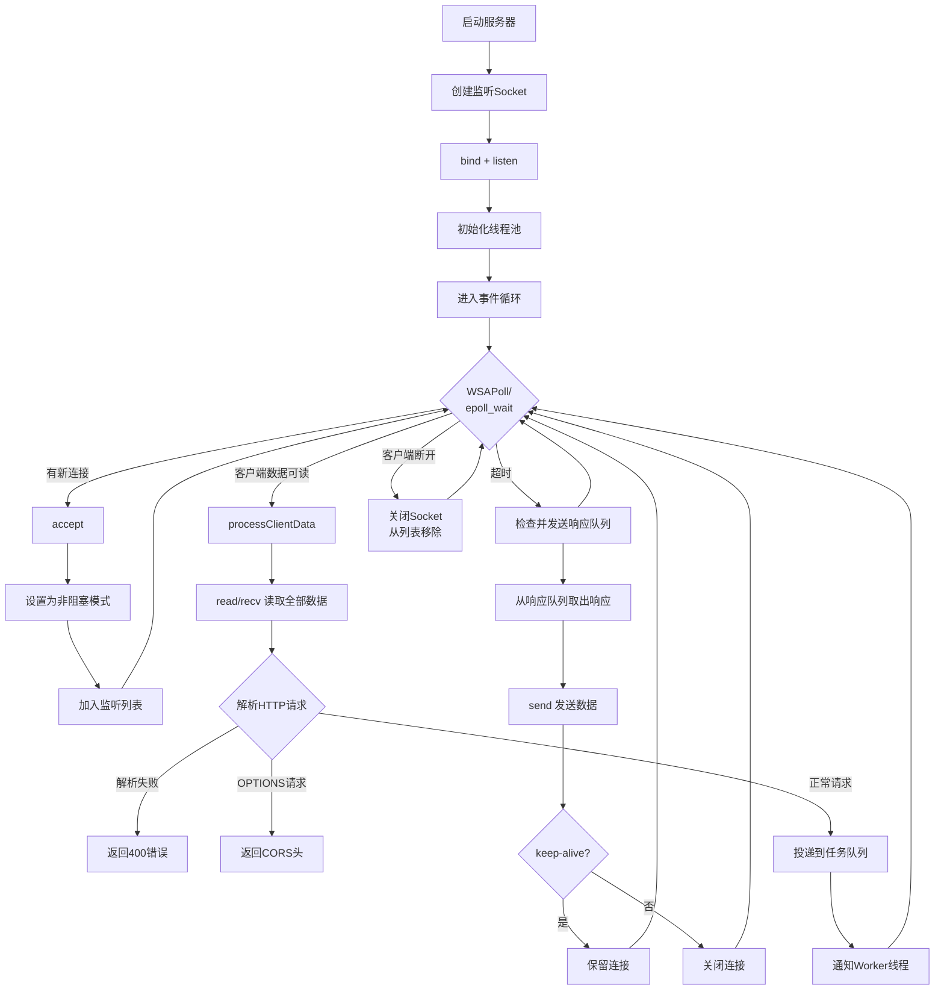
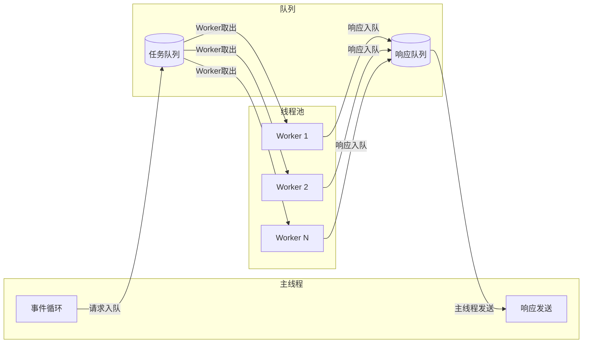
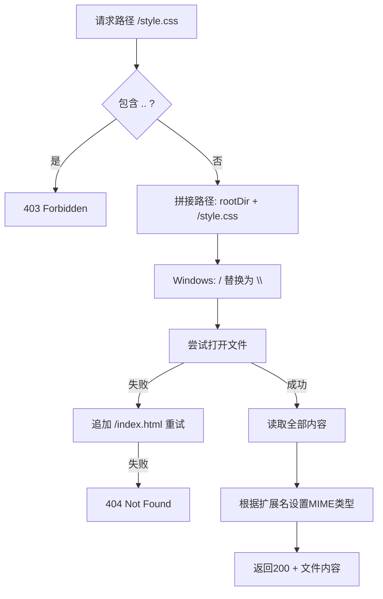
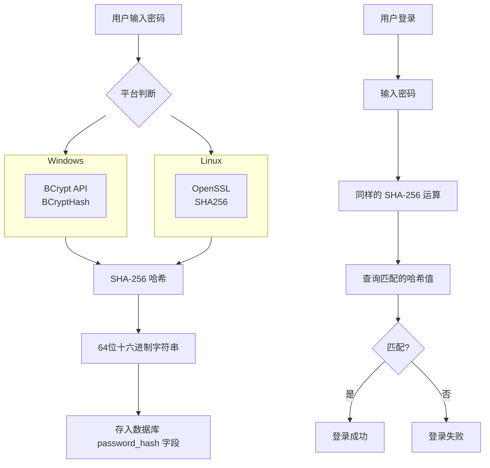
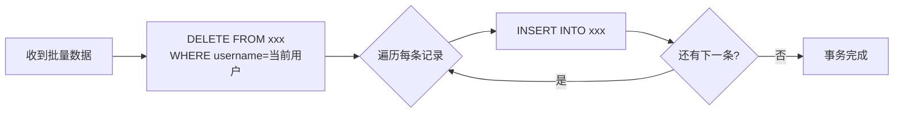
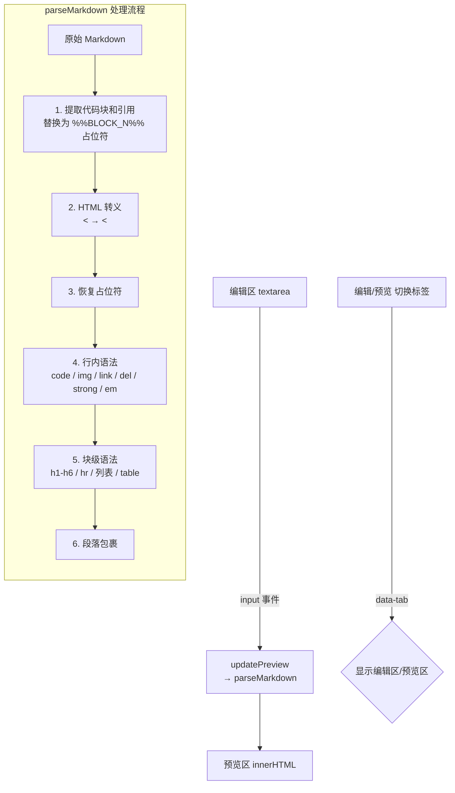
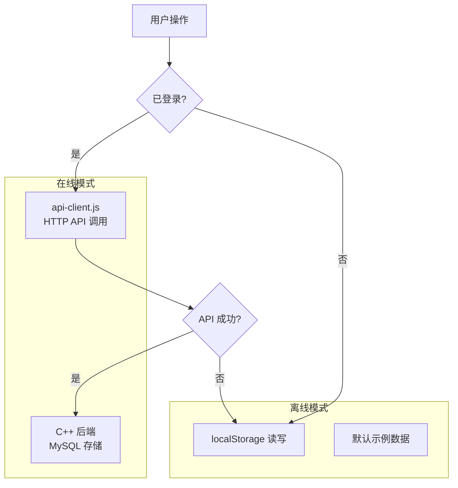
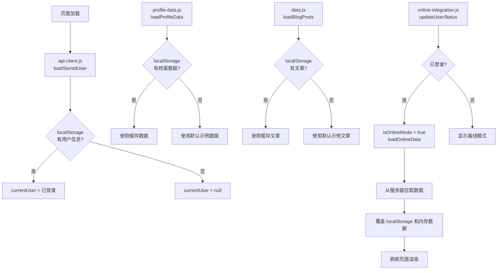
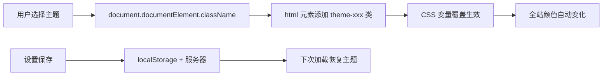

# 个人博客网站 - 技术实现文档

## 目录

1. [系统架构总览](#1-系统架构总览)
2. [HTTP 服务器模块](#2-http-服务器模块)
3. [数据库模块](#3-数据库模块)
4. [路由与业务逻辑](#4-路由与业务逻辑)
5. [前端 SPA 架构](#5-前端-spa-架构)
6. [数据流与同步机制](#6-数据流与同步机制)
7. [主题系统](#7-主题系统)
8. [编译与部署](#8-编译与部署)

---

## 1. 系统架构总览

### 1.1 整体架构

```
┌──────────────────────────────────────────────────────────┐
│                      浏览器 (SPA)                         │
│  ┌───────────┐ ┌──────────┐ ┌───────────────────────┐   │
│  │ 路由渲染   │ │ 数据管理  │ │ 在线/离线模式切换      │   │
│  │ app.js    │ │ data.js  │ │ online-integration.js │   │
│  │           │ │ profile  │ │ api-client.js         │   │
│  └───────────┘ └──────────┘ └───────────────────────┘   │
└──────────────────────┬───────────────────────────────────┘
                       │ HTTP REST API (JSON)
                       ▼
┌──────────────────────────────────────────────────────────┐
│                   C++ HTTP Server                         │
│  ┌──────────────────────────────────────────────┐        │
│  │              事件循环 (eventLoop)              │        │
│  │  Windows: WSAPoll / Linux: epoll_wait        │        │
│  │  监听 → accept → 读数据 → 投递到任务队列       │        │
│  │  响应队列 → send → keep-alive/close           │        │
│  └──────────────┬───────────────────────────────┘        │
│                 │                                         │
│  ┌──────────────▼───────────────────────────────┐        │
│  │             线程池 (Worker 线程)               │        │
│  │  从任务队列取请求 → routeRequest() → 返回响应   │        │
│  └──────────────┬───────────────────────────────┘        │
│                 │                                         │
│  ┌──────────────▼───────────────────────────────┐        │
│  │          路由分发 (routeRequest)               │        │
│  │  ┌───────────┐  ┌────────────────────────┐   │        │
│  │  │ API 路由   │  │    静态文件服务          │   │        │
│  │  │ /api/*    │  │    index.html, *.js    │   │        │
│  │  └─────┬─────┘  │    *.css, *.png...     │   │        │
│  │        │        └────────────────────────┘   │        │
│  ┌───────▼──────────────────────────────┐        │
│  │        BlogDB (MySQL C API)           │        │
│  │  用户管理 · 文章管理 · 档案管理 · 设置  │        │
│  └───────┬──────────────────────────────┘        │
└──────────┼──────────────────────────────────────────┘
           ▼
┌──────────────────────┐
│    MySQL 5.7+        │
│    Database: blogdb  │
│    7 张表            │
└──────────────────────┘
```

### 1.2 请求处理流程

```
客户端 HTTP 请求
    │
    ▼
┌──────────────────────────────────────────────────┐
│ 1. WSAPoll/epoll_wait 检测到事件                  │
│    ├─ 新连接 → accept() → 设置为非阻塞 → 加入轮询列表 │
│    └─ 数据可读 → recv/read() → 读取全部数据        │
└──────────────────┬───────────────────────────────┘
                   ▼
┌──────────────────────────────────────────────────┐
│ 2. 解析 HTTP 请求                                 │
│    ┌─────────────────────────────────────────┐   │
│    │ parseHttpRequest(raw)                   │   │
│    │ ① 查找 "\r\n\r\n" 分割头部和正文         │   │
│    │ ② 解析请求行: GET /api/posts HTTP/1.1   │   │
│    │ ③ 解析头部键值对                          │   │
│    │ ④ URL 解码路径                           │   │
│    └─────────────────────────────────────────┘   │
└──────────────────┬───────────────────────────────┘
                   ▼
┌──────────────────────────────────────────────────┐
│ 3. 投递到 Worker 线程池                           │
│    m_taskQueue.push({clientFd, request})          │
│    m_queueCV.notify_one()                         │
└──────────────────┬───────────────────────────────┘
                   ▼
┌──────────────────────────────────────────────────┐
│ 4. Worker 线程处理                                 │
│    ┌─────────────────────────────────────────┐   │
│    │ routeRequest(request)                   │   │
│    │  ├─ API 路由: m_routes["GET"][path]     │   │
│    │  └─ 静态文件: serveStaticFile(path)      │   │
│    │ 返回 HttpResponse                        │   │
│    └─────────────────────────────────────────┘   │
└──────────────────┬───────────────────────────────┘
                   ▼
┌──────────────────────────────────────────────────┐
│ 5. 响应入队 → 事件循环发送                        │
│    m_responseQueue.push({clientFd, response})     │
│    → eventLoop 检测到队列不为空                    │
│    → send() 发送响应数据                          │
│    → keep-alive? 保留连接 : 关闭连接              │
└──────────────────────────────────────────────────┘
```

---

## 2. HTTP 服务器模块

### 2.1 概述

`HttpServer` 类（`httpserver.h` / `httpserver.cpp`）是一个跨平台的高并发 HTTP 服务器，采用 **事件驱动 + 线程池** 模型。

| 平台 | I/O 模型 | 函数 |
|------|----------|------|
| Windows | WSAPoll（轮询） | `WSAPoll()` |
| Linux | epoll（边缘触发） | `epoll_wait()` |

### 2.2 核心数据结构

```cpp
// HTTP 请求
struct HttpRequest {
    std::string method;      // GET/POST/PUT/DELETE
    std::string path;        // /api/posts?username=xxx
    std::string version;     // HTTP/1.1
    std::unordered_map<std::string, std::string> headers;
    std::string body;        // JSON 正文
};

// HTTP 响应
struct HttpResponse {
    int statusCode = 200;
    std::string statusText = "OK";
    std::unordered_map<std::string, std::string> headers;
    std::string body;
    
    // 便捷设置内容和 CORS 头
    void setContent(content, contentType);
    // 序列化为 HTTP 协议字符串
    std::string toString();
};
```

### 2.3 事件循环流程图



### 2.4 线程池模型



**线程数计算：**
```cpp
unsigned int threadCount = std::max(4u, std::thread::hardware_concurrency() * 2);
// 4核CPU → 8个Worker线程
// 8核CPU → 16个Worker线程
```

### 2.5 关键实现细节

#### 跨平台 Socket 封装

```cpp
#ifdef _WIN32
using socket_t = SOCKET;  // Windows: UINT_PTR
#else
using socket_t = int;     // Linux: 文件描述符
#endif
```

#### 非阻塞模式设置

<table>
<tr><th>Windows</th><th>Linux</th></tr>
<tr>
<td>

```cpp
u_long mode = 1;
ioctlsocket(fd, FIONBIO, &mode);
```

</td>
<td>

```cpp
int flags = fcntl(fd, F_GETFL, 0);
fcntl(fd, F_SETFL, flags | O_NONBLOCK);
```

</td>
</tr>
</table>

#### 请求解析流程

```
原始数据: "POST /api/login HTTP/1.1\r\nContent-Type: ...\r\n\r\n{\"user\":...}"
    │
    ├─ 1. 查找 "\r\n\r\n" 分割头部和正文
    │
    ├─ 2. 解析请求行 (istringstream)
    │      method = "POST"
    │      path   = "/api/login"
    │      version = "HTTP/1.1"
    │
    ├─ 3. 逐行解析头部 (冒号分隔)
    │      "Content-Type: application/json"
    │      "Content-Length: 42"
    │      → headers["Content-Type"] = "application/json"
    │
    └─ 4. URL 解码
           "%20" → " "
           "+"   → " "
```

#### 静态文件服务



MIME 类型映射支持：`.html` `.css` `.js` `.json` `.png` `.jpg` `.gif` `.svg` `.ico` `.txt`

---

## 3. 数据库模块

### 3.1 概述

`BlogDB` 类（`blogdb.h` / `blogdb.cpp`）是对 MySQL C API 的封装，提供线程安全的数据库操作。

### 3.2 数据库表结构

```mermaid
erDiagram
    users ||--o{ posts : 拥有
    users ||--o{ awards : 拥有
    users ||--o{ projects : 拥有
    users ||--o{ work_experience : 拥有
    users ||--o| page_settings : 拥有
    users ||--o| about : 拥有

    users {
        int id PK
        varchar username UK
        varchar password_hash
        varchar nickname
        varchar avatar
        timestamp created_at
    }

    posts {
        int id PK
        varchar username FK
        varchar title
        varchar category
        text tags
        text content
        text excerpt
        timestamp created_at
        timestamp updated_at
    }

    awards {
        int id PK
        varchar username FK
        varchar title
        varchar award_rank
        varchar org
        varchar award_date
        varchar image_url
        text description
    }

    projects {
        int id PK
        varchar username FK
        varchar title
        text tech
        varchar link
        varchar project_date
        text description
    }

    work_experience {
        int id PK
        varchar username FK
        varchar company
        varchar position
        varchar period
        text description
    }

    page_settings {
        varchar username PK FK
        boolean home
        boolean write_page
        boolean archives
        boolean awards
        boolean projects
        boolean work
        boolean about_page
        boolean settings_page
        varchar theme
    }

    about {
        varchar username PK FK
        varchar name
        varchar tagline
        varchar avatar
        text description
        text skills
        varchar email
        varchar github
        varchar zhihu
    }
```

### 3.3 安全机制

| 措施 | 实现 | 说明 |
|------|------|------|
| SQL 注入防护 | `mysql_real_escape_string()` | 所有用户输入都经过转义 |
| 密码加密 | SHA-256 哈希 | 数据库中只存哈希值，不存明文 |
| 线程安全 | `std::mutex` 互斥锁 | 所有数据库操作加锁 |
| 外键约束 | `ON DELETE CASCADE` | 删除用户时自动删除关联数据 |

### 3.4 密码加密流程



**Windows 实现（BCrypt）：**
```cpp
BCryptOpenAlgorithmProvider(&hAlg, BCRYPT_SHA256_ALGORITHM, NULL, 0);
BCryptHash(hAlg, NULL, 0, (PBYTE)password, len, hash, 32);
// 输出: "8d969eef6ecad3c29a3a629280e686cf0c3f5d5a86aff3ca12020c923adc6c92"
```

### 3.5 批量保存策略

竞赛/项目/工作经历使用 **先删后插** 策略：



这种策略简化了前端逻辑——前端每次保存时发送完整的数组，后端全量替换。

### 3.6 页面设置保存策略

```sql
INSERT INTO page_settings (...) VALUES (...)
ON DUPLICATE KEY UPDATE 
    home=VALUES(home), write_page=VALUES(write_page), ...
```

使用 `INSERT ... ON DUPLICATE KEY UPDATE` 实现 **插入或更新**（upsert），无需先判断记录是否存在。

---

## 4. 路由与业务逻辑

### 4.1 路由注册

```cpp
// blog_server.cpp main()
server.post("/api/register", handleRegister);
server.post("/api/login", handleLogin);
server.get("/api/posts", handleGetPosts);
server.post("/api/posts", handleAddPost);
server.del("/api/posts", handleDeletePost);
server.get("/api/awards", handleGetAwards);
server.post("/api/awards", handleSaveAwards);
server.get("/api/projects", handleGetProjects);
server.post("/api/projects", handleSaveProjects);
server.get("/api/work", handleGetWork);
server.post("/api/work", handleSaveWork);
server.get("/api/settings", handleGetSettings);
server.post("/api/settings", handleSaveSettings);
server.get("/api/about", handleGetAbout);
server.post("/api/about", handleSaveAbout);
```

### 4.2 API 接口汇总

| 方法 | 路径 | 功能 | 请求体 | 响应 |
|------|------|------|--------|------|
| POST | `/api/register` | 注册 | `{username, password, nickname}` | `{success, message}` |
| POST | `/api/login` | 登录 | `{username, password}` | `{success, user}` |
| GET | `/api/posts?username=` | 获取文章 | - | `{posts: [...]}` |
| POST | `/api/posts` | 发布文章 | `{username, title, category, tags, content}` | `{success, post}` |
| DELETE | `/api/posts?username=&id=` | 删除文章 | - | `{success}` |
| GET | `/api/awards?username=` | 获取竞赛 | - | `{awards: [...]}` |
| POST | `/api/awards?username=` | 保存竞赛 | `[{id, title, rank, org, date, image, desc}]` | `{success}` |
| GET | `/api/projects?username=` | 获取项目 | - | `{projects: [...]}` |
| POST | `/api/projects?username=` | 保存项目 | `[{id, title, tech, link, date, desc}]` | `{success}` |
| GET | `/api/work?username=` | 获取工作 | - | `{work: [...]}` |
| POST | `/api/work?username=` | 保存工作 | `[{id, company, position, period, desc}]` | `{success}` |
| GET | `/api/settings?username=` | 获取设置 | - | `{settings: {...}}` |
| POST | `/api/settings?username=` | 保存设置 | `{home, write, ..., theme}` | `{success}` |
| GET | `/api/about?username=` | 获取关于我 | - | `{about: {...}}` |
| POST | `/api/about?username=` | 保存关于我 | `{name, tagline, avatar, description, skills[], email, github, zhihu}` | `{success}` |

### 4.3 JSON 解析（无第三方库）

服务器手动解析 JSON，不依赖任何 JSON 库：

```cpp
// 提取字符串字段
std::string getJsonField(const std::string& body, const std::string& field) {
    // 查找 "fieldname"
    // 找到后面的 ":" 
    // 提取引号内的值
}

// 提取字符串数组
std::vector<std::string> getJsonArray(const std::string& body, const std::string& field) {
    // 查找 "fieldname"
    // 找到后面的 "["
    // 逐个提取引号内的字符串
}
```

这种方式避免了引入第三方 JSON 库，但对于复杂 JSON 结构（嵌套对象、转义字符）支持有限。

### 4.4 文章摘要生成

```cpp
std::string generateExcerpt(const std::string& content) {
    // 1. 去除 HTML 标签
    // 2. 取前 150 个字符
    // 3. 追加 "..."
    // 用于首页文章列表的摘要显示
}
```

---

## 5. 前端 SPA 架构

### 5.1 文件职责

| 文件 | 职责 | 核心功能 |
|------|------|----------|
| `index.html` | SPA 入口 | 所有页面模板、导航栏、弹窗 |
| `style.css` | 全局样式 | CSS 变量体系、响应式布局 |
| `themes.css` | 主题定义 | 5 套主题的 CSS 变量覆盖 |
| `data.js` | 数据层 | 文章数据管理、localStorage 持久化 |
| `profile-data.js` | 档案数据 | 竞赛/项目/工作/关于数据、页面设置、主题管理 |
| `app.js` | 核心逻辑 | Hash 路由、页面渲染、编辑器、事件绑定、Markdown 解析 |
| `api-client.js` | API 客户端 | Fetch 封装、用户状态管理 |
| `online-integration.js` | 在线集成 | 登录弹窗、数据同步、函数覆盖 |

### 5.2 页面路由

```mermaid
flowchart TD
    L[页面加载] --> H{检查 hash}
    H -->|#home| P1[渲染首页]
    H -->|#write| P2[渲染写文章]
    H -->|#archives| P3[渲染归档]
    H -->|#awards| P4[渲染竞赛]
    H -->|#about| P5[渲染关于]
    
    P1 --> A[switchPage('home')]
    P2 --> B[switchPage('write')]
    P3 --> C[switchPage('archives')]
    P4 --> D[switchPage('awards')]
    P5 --> E[switchPage('about')]
    
    A --> R1[renderPosts]
    B --> R2[renderSavedPosts]
    C --> R3[renderArchives]
    D --> R4[renderAwards]
    E --> R5[renderAbout]
    
    subgraph switchPage
        SP[隐藏所有 page → 显示目标 page<br>更新导航栏 active 状态<br>滚动到顶部]
    end
    
    SP -->|按页面类型| RENDER{渲染数据}
```

所有页面通过 `switchPage(pageId)` 切换：

```javascript
function switchPage(pageId) {
    // 1. 隐藏所有 .page 元素
    pages.forEach(p => p.classList.remove('active'));
    // 2. 显示目标页面
    document.getElementById('page-' + pageId).classList.add('active');
    // 3. 更新导航栏
    navLinks.forEach(l => l.classList.remove('active'));
    // 4. 按需渲染数据
    if (pageId === 'write') renderSavedPosts();
    if (pageId === 'awards') renderAwards();
    if (pageId === 'about') renderAbout();
    // ...
}
```

### 5.3 编辑器实现



### 5.4 Markdown 解析流程

Markdown 渲染由 `app.js` 中的 `parseMarkdown()` 函数实现，采用 **纯正则表达式解析器**，不依赖第三方库。解析过程分为 6 个阶段，共 15 步：

```javascript
function parseMarkdown(md) {
    if (!md || !md.trim()) return '';
    
    // 第1步: 提取代码块 (```...```) 到 savedBlocks[]
    // 第2步: 提取行内代码 (`...`) 到 savedBlocks[]
    // 第3步: 提取引用块 (> ...) 到 savedBlocks[]
    // 第4步: HTML 转义 (< → &lt;, > → &gt;)
    // 第5步: 恢复 savedBlocks[] 中的占位符
    
    // 第6步: 行内代码 `<code>...</code>`
    // 第7步: 图片 ``
    // 第8步: 链接 `[]()`
    // 第9步: 删除线 `~~...~~`
    // 第10步: 粗体 `**...**` 和斜体 `*...*`
    // 第11步: 标题 h1-h6 / 分割线 hr
    // 第12步: 无序列表和任务列表
    // 第13步: 有序列表
    // 第14步: 表格
    // 第15步: 段落包裹
}
```

**占位符保护机制：**

代码块和引用块内的内容在 HTML 转义前被替换为 `%%BLOCK_N%%` 占位符，避免 `>` 和 `` ` `` 等字符在转义过程中被破坏：

```
输入:
> 这是一段引用

1. 提取 → savedBlocks[0] = "> 这是一段引用"
          文本变为 "%%BLOCK_0%%"
2. 转义 → (无 > 需要转义，已被提取)
3. 恢复 → "> 这是一段引用" → "<blockquote><p>这是一段引用</p></blockquote>"
```

**语法输出对照：**

| 输入 Markdown | 输出 HTML |
|--------------|-----------|
| `# 标题` | `<h1>标题</h1>` |
| `**粗体**` | `<strong>粗体</strong>` |
| `` `code` `` | `<code>code</code>` |
| `- 列表项` | `<ul><li>列表项</li></ul>` |
| `\| 列1 \| 列2 \|` | `<table><tr><th>列1</th>...</tr></table>` |
| `- [x] 完成` | `<input type="checkbox" checked> 完成` |
| `~~删除~~` | `<del>删除</del>` |

**支持的语法特性：**

| 类别 | 支持程度 |
|------|----------|
| 标题 h1-h6 | 完整支持 |
| 粗体/斜体/删除线 | 完整支持 |
| 行内代码/代码块 | 完整支持，代码块可指定语言（` ```javascript `） |
| 链接/图片 | 完整支持 |
| 有序/无序列表 | 完整支持 |
| 引用 blockquote | 完整支持 |
| 表格 | 完整支持 |
| 任务列表 | 完整支持（checked / unchecked） |
| 分割线 | `---` / `***` / `___` |
| XSS 防护 | 所有文本经过 HTML 转义 |

**不支持的特性：**
- 嵌套列表（仅支持一级列表）
- 嵌套引用
- 自动链接（需手动写 `[text](url)` 语法）
- 转义字符（`\*` 不生效）

**实时预览机制：**

编辑器的 `textarea` 监听 `input` 事件，每次输入变化时调用 `updatePreview()`：

```javascript
function updatePreview() {
    const md = editContent.value;
    if (!md.trim()) {
        editPreview.innerHTML = '<div class="preview-placeholder">🖊️ ...</div>';
        return;
    }
    editPreview.innerHTML = `<div class="article-body">${parseMarkdown(md)}</div>`;
}
```

预览区与文章详情页复用同一套 CSS 样式（`.article-body`），确保编辑预览和最终显示效果一致。

---

## 6. 数据流与同步机制

### 6.1 双模式架构



### 6.2 数据初始化流程



### 6.3 函数覆盖机制（在线集成）

`online-integration.js` 通过同名函数覆盖实现无侵入切换：

```javascript
// 保存原始函数
const _origPublishPost = window.publishPost;

// 覆盖为新函数
window.publishPost = async function() {
    if (!isOnlineMode || !isLoggedIn()) {
        // 离线模式 → 调用原始函数
        if (_origPublishPost) _origPublishPost();
        return;
    }
    // 在线模式 → 调用 API
    const result = await apiAddPost(getUsername(), {...});
    // ...
};
```

被覆盖的函数：`publishPost`、`deletePost`、`saveAwardsFromEdit`、`saveProjectsFromEdit`、`saveWorkFromEdit`、`saveAboutFromEdit`、`saveSettings`

### 6.4 数据隔离机制

为防止不同用户之间的数据串扰：

```javascript
// online-integration.js - loadOnlineData()
async function loadOnlineData() {
    const username = getUsername();
    
    // 关键：始终用服务器数据覆盖本地缓存
    // 即使返回空数组也要覆盖，防止切换账号后残留数据
    const projects = await apiGetProjects(username);
    profileProjects = projects || [];  // 空数组也覆盖
    saveProfileData('projects', projects || []);
}
```

在页面初始化时自动从服务器拉取数据：

```javascript
// 页面加载时，如果已登录则从服务器加载数据
if (isLoggedIn()) {
    loadOnlineData().then(function() {
        // 刷新页面显示
        renderPosts();
        renderProjects();
        // ...
    });
}
```

---

## 7. 主题系统

### 7.1 CSS 变量体系

所有颜色通过 CSS 自定义属性（变量）定义：

```css
:root {
    --primary: #5b7fff;       /* 主色 */
    --primary-dark: #4a6ae0;  /* 主色-深 */
    --primary-light: #eef1ff; /* 主色-浅 */
    --bg: #f8f9fc;            /* 页面背景 */
    --bg-card: #ffffff;       /* 卡片背景 */
    --text: #2c3e50;          /* 正文 */
    --text-light: #7f8c9b;    /* 辅助文字 */
    --text-muted: #b0b8c4;    /* 弱化文字 */
    --border: #e8ecf2;        /* 边框 */
    --shadow: ...;             /* 阴影 */
    --shadow-hover: ...;       /* 悬停阴影 */
    --radius: 14px;           /* 圆角 */
    --transition: ...;         /* 过渡动画 */
}
```

### 7.2 主题切换原理



切换代码：
```javascript
function applyTheme(theme) {
    document.documentElement.className = '';
    if (theme !== 'default') {
        document.documentElement.classList.add('theme-' + theme);
    }
}
```

### 7.3 五套主题

| 主题 | CSS 类 | 主色 | 背景色 | 风格 |
|------|--------|------|--------|------|
| 默认 | (无) | `#5b7fff` 蓝 | `#f8f9fc` 白 | 清爽 |
| 暗黑 | `theme-dark` | `#7c9aff` 亮蓝 | `#0f1117` 黑 | 夜间友好 |
| 森林 | `theme-forest` | `#2d8a4e` 绿 | `#f5faf6` 浅绿 | 自然 |
| 日落 | `theme-sunset` | `#d97706` 橙 | `#fef9ef` 暖黄 | 温暖 |
| 海洋 | `theme-ocean` | `#0891b2` 青 | `#f4fafb` 浅蓝 | 清新 |

---

## 8. 编译与部署

### 8.1 Windows 编译

**环境要求：**
- Visual Studio 2019+（MSVC）
- MySQL 5.7+（含 `libmysql.lib` 和头文件）
- Windows 7+（需要 `winsock2.h`）

**编译命令：**
```bash
# 设置 VC 环境
"C:\Program Files (x86)\Microsoft Visual Studio\2019\Community\VC\Auxiliary\Build\vcvars64.bat"

# 编译
cl /EHsc /std:c++17 /utf-8 /I"C:\MySQL\include" ^
    /Fe:server\blog_server.exe ^
    server\blog_server.cpp ^
    server\httpserver.cpp ^
    server\blogdb.cpp ^
    /link /LIBPATH:"C:\MySQL\lib" libmysql.lib ws2_32.lib
```

**运行依赖：**
- `libmysql.dll`（需要和 exe 在同一目录）

### 8.2 Linux 编译

```bash
# 安装依赖
apt-get install libmysqlclient-dev libssl-dev cmake g++

# 编译
cd server && mkdir build && cd build
cmake .. && make -j$(nproc)
```

### 8.3 数据库初始化

在 MySQL 中执行以下语句创建数据库和表结构：

```sql
CREATE DATABASE IF NOT EXISTS blogdb CHARACTER SET utf8mb4 COLLATE utf8mb4_unicode_ci;
USE blogdb;

CREATE TABLE IF NOT EXISTS users (
    id INT AUTO_INCREMENT PRIMARY KEY,
    username VARCHAR(50) UNIQUE NOT NULL,
    password_hash VARCHAR(64) NOT NULL,
    nickname VARCHAR(50),
    avatar VARCHAR(255),
    created_at TIMESTAMP DEFAULT CURRENT_TIMESTAMP
);
-- ... 其余表结构见 docs/user-manual.md
```

`blogdb` 数据库包含 7 张表：`users`, `posts`, `awards`, `projects`, `work_experience`, `page_settings`, `about`。

### 8.4 启动参数

```bash
blog_server [port] [db_host] [db_port] [db_user] [db_pass] [db_name]
```

默认值：`8080 127.0.0.1 3306 lyc 123456789 blogdb`
